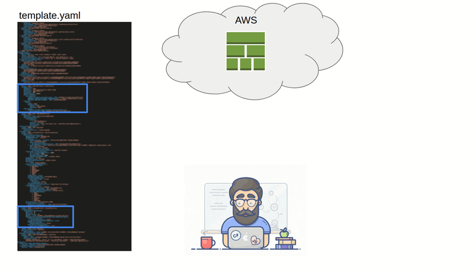

## cfn-subset

Extract a subset of a CloudFromation template into a bite-sized sub-template for quick development and deployments for integration or manual testing in AWS.

**This is work in progress and may contain bugs**

### Usage
When working on large CloudFormation templates it's likely that you will only be interested in a small subset of resources. This tool will extract these into a smaller deployable template which you can work on and, when happy, merge back in to the main template.

### SAM integration
If your project has a samconfig.toml file, a copy of that will be created with the stack_name parameter chnaged to `sub--<stackname>-<random adjective>-<random noun>`. This is so you can deploy your substack alongside the original stack without interfering with what's already deployed. A prerequisite is that you don't implicitly name any resources as there will be naming clash